  

  
  
  
  

### 🍎 About me

- 🌉 I work on **cross-chain bridges** and many other projects at Wanchain — 1,200+ commits to [wandevs](https://github.com/wandevs).
- 💸 I write **DeFi tools**: a [desktop wallet](https://github.com/Auto-Wallet/auto-desktop), flash-loan arbitrage, Aave rescue scripts, and EIP-7702 revoke tools.
- 🦀 Lately I write **Rust**, mostly small games with macroquad.
- 🤖 I make **CLIs and Claude Code skills** so agents can read chains, DeFi yields and WeChat.

### 🛠 Things I've built

| | Project | What it does |
|---|---|---|
| 🦀 | [rust-word-invasion](https://github.com/lolieatapple/rust-word-invasion) | Typing-defense game on Basic English 850 — [play it](https://word.nannan.app) |
| 🧮 | [obsidian-table-column-resize](https://github.com/lolieatapple/obsidian-table-column-resize) | Obsidian plugin: drag to resize table columns |
| 🛡️ | [revoke-eip7702](https://github.com/lolieatapple/revoke-eip7702) | Revoke bad EIP-7702 delegations without funding the hacked EOA |
| 📈 | [ccxt-cli](https://github.com/lolieatapple/ccxt-cli) | Trade on 130+ crypto exchanges from the terminal |
| 🔍 | [debank-cli](https://github.com/lolieatapple/debank-cli) · [skill](https://github.com/lolieatapple/debank-skill) | Wallet balances, DeFi positions and NFTs from DeBank |
| 🌾 | [yieldsllama-skill](https://github.com/lolieatapple/yieldsllama-skill) | Claude Code skill: find the best DeFi yields |
| 🎨 | [quiver-ai-cli](https://github.com/lolieatapple/quiver-ai-cli) · [skill](https://github.com/lolieatapple/quiver-ai-skill) | Make and vectorize SVGs with AI |
| 💬 | [weixin-claw-cli](https://github.com/lolieatapple/weixin-claw-cli) | Send WeChat messages and files from the terminal |
| 🔐 | [secret-holder](https://github.com/lolieatapple/secret-holder) | macOS wallet address book with Touch ID |
| 🧱 | [rust-tetris](https://github.com/lolieatapple/rust-tetris) · [breakout-deluxe](https://github.com/lolieatapple/breakout-deluxe) | Classic games, rebuilt in Rust |

### 🧰 Tools I use

  

### 📊 Stats

  

  

🍏 Every chart here is built from the GitHub API by <a href="scripts/generate.mjs">one script</a> and refreshed daily.

